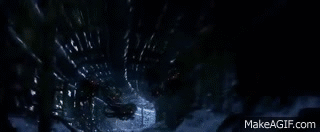

# Game-Engines-2-Project
My project is based on the real world scenes in The Matrix(1999).
The scene will feature the protagonist's ship; The Nebuchadnezzar flying through the tunnel system sticking to the centre of the path, The Nebuchadnezzar will turn a corner revelaing an oncoming sentinelle. The Nebuchadnezzar will react by shutting off it's power and parking as the Sentinelle flys past. Later the Nebuchadnezzar will turn it's power back on as several other sentinelles turn the corner. They will begin to chase the Nebuchadnezzar as it shoots at them. For every sentinelle that is destroyed, more will appear unttl the Nebuchadnezzar eventually uses an EMP to disable the wave of sentinelles and successfully escape.

